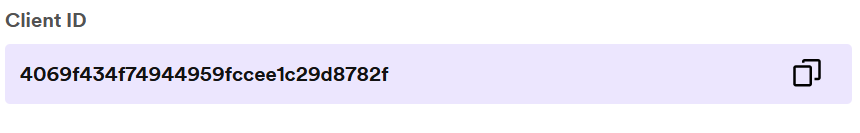
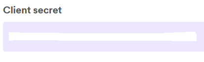

# How To get Token

### You need Client Id and Client Secret

- To find Client Id and Secret Vists
  https://developer.spotify.com/dashboard/

<picture>
  
</picture>

<picture>
  
</picture>

### 1. Make a curl request using this command

- **Replace client_id with your client_id and your client secret with secret**

curl -X POST "https://accounts.spotify.com/api/token" -H "Content-Type: application/x-www-form-urlencoded" -d "grant_type=client_credentials&client_id="<<client_id>>"&client_secret="<<client_secret>>""

### Response Should look something like this

{"access_token":"<<TOKEN>>","token_type":"Bearer","expires_in":3600}

### 2. Once you have Token Update .env file or create one

### 3. .env file should look like this

- ACCESS_TOKEN = "<<Token>>"
